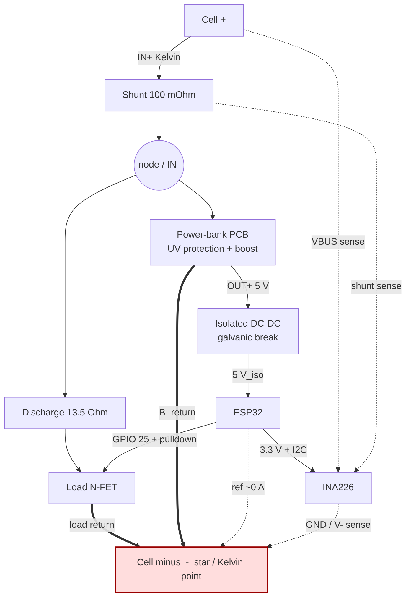

# accucheck2 — Development Plan Overview

## Project Summary

A LiIon battery cell tester that measures capacity (mAh), energy (Wh), and DC internal
resistance (DCIR) using an ESP32 + INA226, with WiFi-based logging via HTTP GET requests
to an external server.

## Key Design Decisions

| Decision | Choice |
|---|---|
| MCU | ESP32 |
| Framework | Arduino (C++) |
| Current sensor | INA226, 16-bit, I2C |
| Shunt resistor | 100 mΩ |
| Discharge levels | 1 (13.5Ω = 2×27Ω parallel, ~274 mA) |
| Logging | HTTP GET to external server, parameters in URL |
| Measurement interval | 10 seconds |
| Power supply | USB power bank PCB (cell → 5V step-up), proven UV protection retained |
| Logic supply | Isolated DC-DC from the power-bank 5V → galvanic break to the measurement side |
| Grounding | Two domains, GND_PWR and GND_MEAS, joined **only** at the cell − terminal |
| WiFi power save | Disabled (modem-sleep off) — avoids ~100 ms beacon-wake current spikes in the DCIR samples; trade-off is a steady ~320 mA cell-side ESP draw |
| PCB | Breadboard/perfboard initially, KiCad later |

## Development Phases

| Phase | Description | Status | Details |
|---|---|---|---|
| 1 | Hardware setup & basic I2C | partial | [phase1_hardware_bringup.md](phase1_hardware_bringup.md) |
| 2 | Measurement & calibration | done | [phase2_measurement.md](phase2_measurement.md) |
| 3 | Discharge control & capacity test | partial | [phase3_discharge_control.md](phase3_discharge_control.md) |
| 4 | DCIR measurement | done | [phase4_dcir.md](phase4_dcir.md) |
| 4b | DCIR measurement tooling | done | [phase4b_dcir_tooling.md](phase4b_dcir_tooling.md) |
| 5 | WiFi & HTTP logging | done | [phase5_wifi_logging.md](phase5_wifi_logging.md) |
| 6 | PHP server & visualization | done | [phase6_server.md](phase6_server.md) |
| 7 | Further improvements | partial | [phase7_integration.md](phase7_integration.md) |
| 8 | (Optional) PCB design | open | [phase8_pcb.md](phase8_pcb.md) |

## Hardware Block Diagram

The 100 mΩ shunt sits directly at the cell's positive terminal, so it carries
**all** current the cell delivers — both the discharge resistor and the power
bank (which feeds the ESP). The ESP is powered through an **isolated DC-DC**, so
the logic/measurement side has its own ground (GND_MEAS) that is bonded to the
cell's negative terminal independently of the power bank. This gives true 4-wire
(Kelvin) sensing of the cell voltage and keeps the load FET safely controllable
even when the power bank's undervoltage protection trips.



Legend: solid arrows = power/signal flow, **heavy arrows (==>)** = high-current
returns in **GND_PWR**, **dotted arrows (-.->)** = sense/reference lines in
**GND_MEAS** (carry essentially no current).

### Net table (who connects where)

| Net | Members | Current |
|---|---|---|
| **Cell +** | cell positive; shunt IN+; INA226 VBUS sense (Kelvin) | load + supply |
| **node / IN−** | shunt IN−; discharge-resistor top; power-bank B+ | load + supply |
| **GND_PWR** | load-FET source; power-bank B− | heavy (load + supply return) |
| **GND_MEAS** | isolated DC-DC secondary gnd; ESP32 GND; INA226 GND (= V− sense); FET gate pull-down ref | ~0 (INA Iq only) |
| **Cell −** | star point — GND_PWR and GND_MEAS meet here and **only** here | — |

The isolation barrier is in the power path only: power-bank OUT+/P− (primary)
↔ isolated DC-DC ↔ 5 V_iso / GND_MEAS (secondary). The power-bank's P− bonds to
GND_PWR through its internal protection FET; the barrier keeps the ESP supply
current out of GND_MEAS.

Notes:
- The shunt is the single point through which the entire cell current flows, so
  capacity (mAh) and energy (Wh) include the ESP's own consumption. With WiFi
  modem-sleep disabled the ESP draws a steady ~320 mA (cell side) — a notable
  fraction of the total discharge current, which raises the effective C-rate.
  This is accepted by design; capacity/energy are the cell's true totals.
- Because GND_MEAS is tied to the cell − independently of the power bank, the
  load FET's gate and source share the true cell-negative reference; a gate
  pull-down keeps it **off** if the ESP loses power or hangs (fail-safe).
- ESP GPIO can drive the FET gate directly (no opto needed), since ESP ground =
  GND_MEAS = the FET-source reference.

## File Structure (planned)

```
accucheck2/
├── readme.md
├── doc/
│   ├── plans/
│   │   ├── overview.md              (this file)
│   │   ├── phase1_hardware_bringup.md
│   │   ├── phase2_measurement.md
│   │   ├── phase3_discharge_control.md
│   │   ├── phase4_dcir.md
│   │   ├── phase4b_dcir_tooling.md
│   │   ├── phase5_wifi_logging.md
│   │   ├── phase6_server.md
│   │   ├── phase7_integration.md
│   │   └── phase8_pcb.md
│   └── reports/
│       └── dcir_report_*.html       (measurement reports)
├── tools/
│   └── dcir_plot.py                 (DCIR measurement & plotting tool)
├── webspace/
│   ├── add.php                      (data receiver endpoint)
│   ├── data.php                     (data API for visualization)
│   ├── index.php                    (visualization page)
│   └── data/.htaccess               (deny direct browsing)
└── arduinosketch/
    └── accucheck2/
        ├── accucheck2.ino           (main sketch)
        ├── ina226.h / ina226.cpp    (INA226 driver)
        ├── discharge.h / .cpp       (FET control, discharge logic)
        ├── dcir.h / dcir.cpp        (DCIR measurement routine)
        ├── logger.h / logger.cpp    (WiFi + HTTP GET logging)
        ├── led.h / led.cpp          (status LED / firmware heartbeat)
        ├── watchdog.h / .cpp        (hardware task watchdog — resets on hang)
        ├── config.h                 (pins, calibration, WiFi credentials)
        └── config.h.example         (template for config.h)
```
