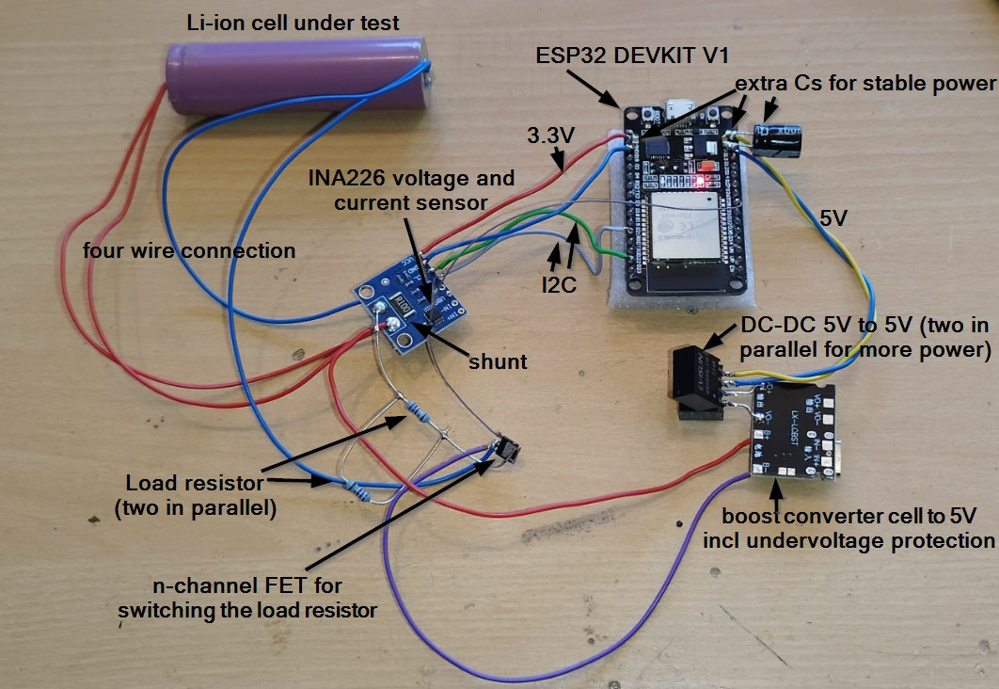

# accucheck2

ESP32-based LiIon single-cell tester for capacity (mAh), energy (Wh) and DC internal resistance (mΩ).

**Status:** Phases 2–6 complete (measurement, discharge, DCIR, WiFi logging, PHP server & live web visualization). Hardware grounding/isolation rework (phase 1) and further improvements (phase 7) in progress. See [doc/plans/overview.md](doc/plans/overview.md) for the roadmap.

## Goals:

- measure capacity (mAh), energy (Wh) and internal resistance (mΩ) of single LiIon battery cell
- no charging, only discharging
- powered by the cell under test
- logging to PHP endpoint on web server via WiFi
- live visualization of voltage, current and capacity in a web browser

## Measuring method for R_i: DC Internal Resistance (DCIR) — Load Step Test

Principle: Apply a known current pulse and measure the voltage drop.

Combined with Four-Wire measurement, to eliminate the effect of contact resistances

## Hardware Concept

- ESP32 for I2C, GPIOs, WiFi
- INA226 for measurement of cell voltage and cell current (via shunt). 16 bit resolution. I2C connection to the ESP32
- shunt (100 mΩ) placed directly at the cell terminal, so the INA226 measures the **total** cell current (discharge load + ESP32 supply); capacity and energy therefore include the tester's own consumption
- single discharge path (13.5 Ω = 2×27 Ω parallel, ~274 mA), controlled via an n-channel FET
- optional: NTC for cell temperature measurement
- supply with PCB of an USB power bank (cell-to-5V step-up, undervoltage shutdown, short-circuit protection), feeding the ESP through an **isolated DC-DC** so the measurement side has its own ground (true 4-wire sensing, fail-safe FET control)
- two ground domains (GND_PWR, GND_MEAS) joined only at the cell − terminal

See the [hardware block diagram](doc/plans/overview.md#hardware-block-diagram) in the overview for the full wiring concept.

## Development Plan

See [doc/plans/overview.md](doc/plans/overview.md) for the detailed development plan.

## Measurement Reports

- [DCIR report 2026-06-24](https://uhi22.github.io/accucheck2/doc/reports/dcir_report_20260624_093034.html) — 5× DCIR measurements, mean 96.1 mOhm, spread 2.5 mOhm
